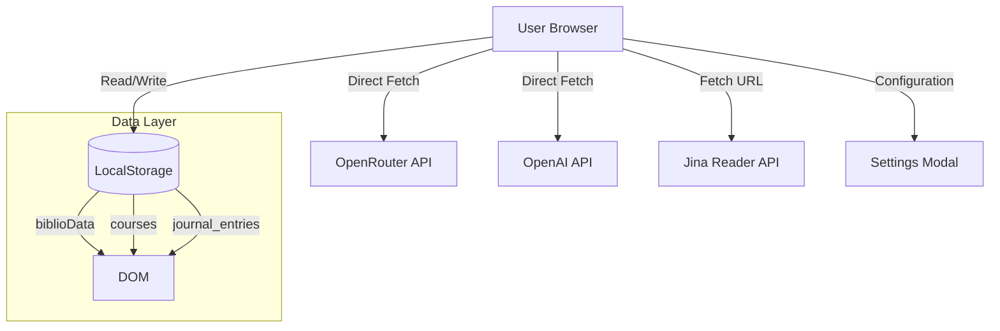

# ⚙️ Technical Documentation (Millino Fagiolino v6.0)

## 🏗️ Architecture

The OS follows a **Strict Client-Side** architecture. There is NO backend server owned by Millino. 
All "server-like" intelligence is achieved via direct browser-to-API calls (OpenAI/OpenRouter) or third-party stateless services (Jina).



---

## 💾 Data Data Structure

### 1. `biblioData` (Master Database)
Stored in LocalStorage as `millino_custom_books`. Merged at runtime with `MASTER_DB` (static).

```json
{
  "id": "U1234",               // Unique ID (Sxx=Static, Uxx=User)
  "title": "Book Title",
  "author": "Author Name",
  "year": "2024",
  "pub": "Publisher",
  "cat": "Primary Sources",    // Category
  "status": "todo",            // 'todo' | 'reading' | 'done'
  "tags": ["Tag1", "Tag2"],
  "notes": "User manual notes...", 
  "squadAnalysis": {           // AI-Generated Metadata
    "architect": "graph TD; ...",
    "relationist": [{"source": "A", "target": "B", "relation": "..."}],
    "extractor": [{"quote": "...", "paraphrase": "..."}],
    "strategist": ["Arg 1", "Arg 2"]
  }
}
```

### 2. `courses` (Exam Programs)
Stored in LocalStorage as `millino_courses`.

```json
{
  "id": "course_123",
  "name": "Theoretical Philosophy",
  "prof": "Prof. Name",
  "date": "2026-06-15",        // Exam Date
  "exam_info": {
    "mode": "Oral",            // Oral | Written | Project
    "description": "Exam details...",
    "tips": "AI Tip"
  },
  "topics": [
    {
      "title": "Module 1",
      "goal": "Module Objective",
      "texts": ["S01", "D03"]  // Linked Book IDs
    }
  ]
}
```

---

## ⚡ Key Functions

### `runSyllabusImport()` (The Syllabus Parser)
Located in `index.html`.
1. **Input**: Accepts Raw Text or URL.
2. **Jina Integration**: If input is URL, calls `https://r.jina.ai/{url}` to fetch Markdown content.
3. **AI Pipeline**: Sends text to `DeepSeek V3.2` (via OpenRouter) with a specialized "Linker Prompt".
    - **Logic**: The prompt receives the *current bibliography* as context.
    - **Task**: Provides JSON Modules *and* attempts to link specific modules to existing Book IDs based on author/title matching.

### `SquadEngine` (js/squad_engine.js)
A class-based agent pipeline that processes PDFs.
- **Ingestion**: Uses `pdf.js` to extract full text (client-side).
- **Agents**: Sequentially calls API for:
    1. **Architect**: Mermaid Diagram generation.
    2. **Relationist**: Concept extraction.
    3. **Extractor**: Atomic quote mining.
    4. **Strategist**: Argument generation.
- **Fail-Safe**: Uses `safeJSONParse()` (Line 472) to strip Markdown code blocks often returned by LLMs.

### `syncDataToCloud()` (Gist Sync)
*Current Status: Implementation Pending.*
- The UI exposes "GitHub Token" and "Gist ID" fields in `Settings`.
- Data is currently persisted **only** to `LocalStorage`.
- **Planned Logic**: A `PATCH` request to `https://api.github.com/gists/{gist_id}` with `MASTER_DB` content serialized as JSON.

---

## 🔒 Security Model

**"Client-Side Secret"**
- **API Keys**: (OpenAI, OpenRouter, GitHub) are stored in `localStorage`.
- **Transmission**: Keys are injected into HTTP headers (`Authorization: Bearer ...`) *only* during the specific API call.
- **No Proxy**: There is no middle-man server. If the user's browser is compromised, keys are compromised. This is standard for local-first tools.
